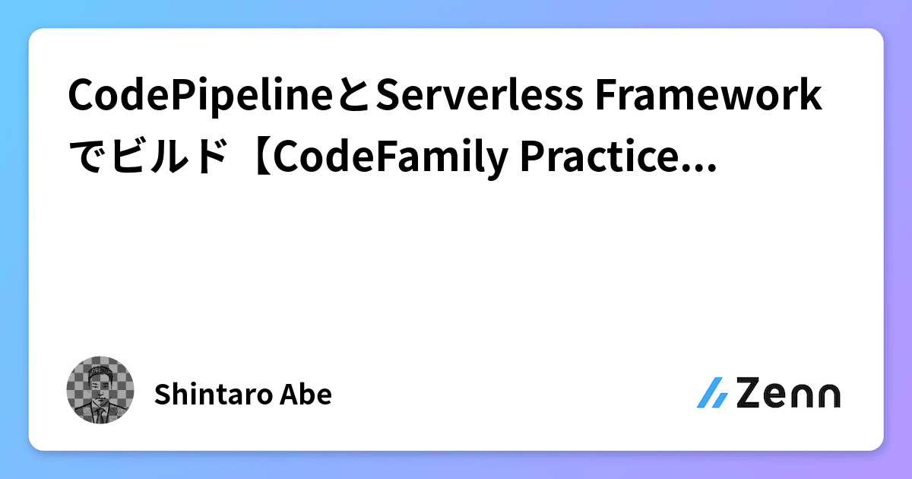
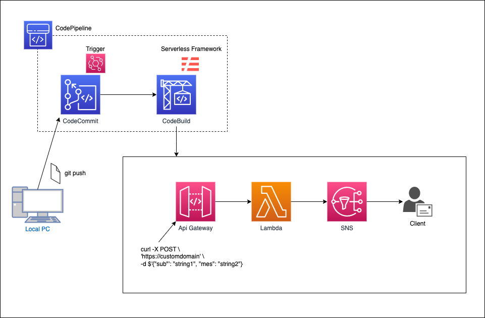
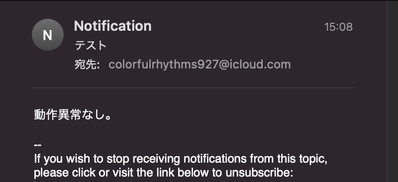

# codefamily-serverless
## Refferemce article
Zennに投稿した、「CodePipelineとServerless Frameworkでビルド【CodeFamily Practices 6/7】」に掲載したコードを収録したリポジトリ。

<a href="https://zenn.dev/lifewithpiano/articles/codefamily_serverless">
## Summary
API GatewayとLambdaの挙動を確認するための、シンプルな構成。

* ソースステージをCodeCommit、ビルドステージをCodeBuildに設定したCodePipelineを構築。
* ビルドはServerlessを使用。
* API Gatewayへメールのタイトルと本文を指定してアクセスをすると、SNSトピックのサブスクリプションへメールを送信
* 送信に成功すると、サブジェクトとメッセージの値をレスポンス。



* __コマンド__

```
curl -X POST \
'https://Your-domain-name' \
-d $'{"sub": "テスト", "mes": "動作異常なし。"}'
```
* __メール__



## Regarding plugin

API Gatewayに付与するカスタムドメインの作成に、 __Domain Managerプラグイン__ を使用。
* __Domain Managerパッケージをインストール__

```
npm install serverless-domain-manager
```
* __インストールとドメイン作成__


ドメインの作成。

```
serverless create_domain
```
Serverless frameworkのデプロイ。

```
serverless deploy
```
* __リソースの削除__

Serverless frameworkの削除。

```
serverless remove
```
ドメインの削除。

```
serverless delete_domain
```